## Contents
{:.no_toc}
*  
{: toc}


## Preliminary EDA on 2010 Data

### Data Import


```python
df_2010 = pd.read_csv('../data/merged/eda_2010.csv')
df_2010.info()
```


    <class 'pandas.core.frame.DataFrame'>
    RangeIndex: 94 entries, 0 to 93
    Columns: 191 entries, year to murder_per_100_k
    dtypes: float64(173), int64(17), object(1)
    memory usage: 140.3+ KB


### Histogram


```python
with sns.axes_style("darkgrid"):
    plt.hist(df_2010.murder_per_100_k.values, bins=50, facecolor='black')
    plt.axvline(df_2010.murder_per_100_k.mean(), 0, 1, color='r', label='Mean')
    plt.xlabel("Murders Per 100k")
    plt.ylabel("Counts")
    plt.title("Murders Per 100k Histogram")
    plt.legend()
```


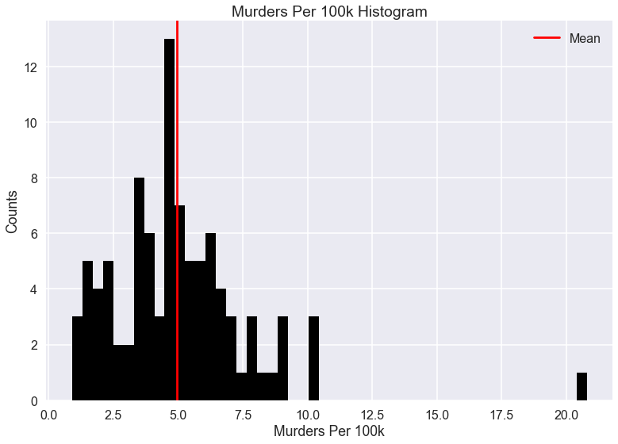


```python
relevant_cols = ['family_households_married-couple_family',
                 'family_household_married_couple_family_with_own_children_under_18_years',
                 'family_households_female_householder_no_husband_present',
                 'family_households_female_householder_no_husband_present_with_own_children_under_18',
                 'now_married_except_separated',
                 'less_than_high_school_diploma',
                 'high_school_graduate_or_higher',
                 'unmarried_portion_of_women_15_to_50_years_who_had_a_birth_in_past_12_months',
                 'civilian_noninst_population_18_to_64_years_with_a_disability',
                 'civilian_noninst_population_65_years_and_older_with_a_disability',
                 'industry_transportation_and_warehousing_and_utilities',
                 'median_household_income_(dollars)',
                 'households_with_supplemental_security_income',
                 'households_with_food_stamp_snap_benefits',
                 'median_family_income_(dollars)',
                 'percentage_married-couple_family',
                 'percentage_female_householder_no_husband_present_family',
                 'poverty_all_families',
                 'poverty_all_families_with_related_children_under_18_years',
                 'poverty_all_families_with_related_children_under_18_years_with_related_children_under_5_years_only',
                 'poverty_all_people',
                 'poverty_65_years_and_over',
                 'no_telephone_service_available',
                 'house_median_value_(dollars)',
                 'murder_per_100_k']
```


```python
selected_cols = ['unmarried_portion_of_women_15_to_50_years_who_had_a_birth_in_past_12_months',
                 'percentage_female_householder_no_husband_present_family',
                 'poverty_all_people',
                 'households_with_food_stamp_snap_benefits',
                 'less_than_high_school_diploma',
                 'now_married_except_separated',
                 'percentage_married-couple_family',
                 'house_median_value_(dollars)',
                 'murder_per_100_k']
```


```python
selected_col_x_vals = ['Unmarried Percent Of Women Who Gave Birth In Last 12 Months',
                       'Female Householder No Husband Present Family (% Of Families)',
                       'Living In Poverty (% Of Pop.)',
                       'Collects Food Stamp Benefits (% Of Households)',
                       'Less Than High School Diploma (% Of Pop.)',
                       'Married Except Separated (% Of Pop.)',
                       'Married-Couple Family (% Of Families)',
                       'House Median Value (Dollars)',
                       'Murders Per 100,000 People']
```


### Scatter Plots


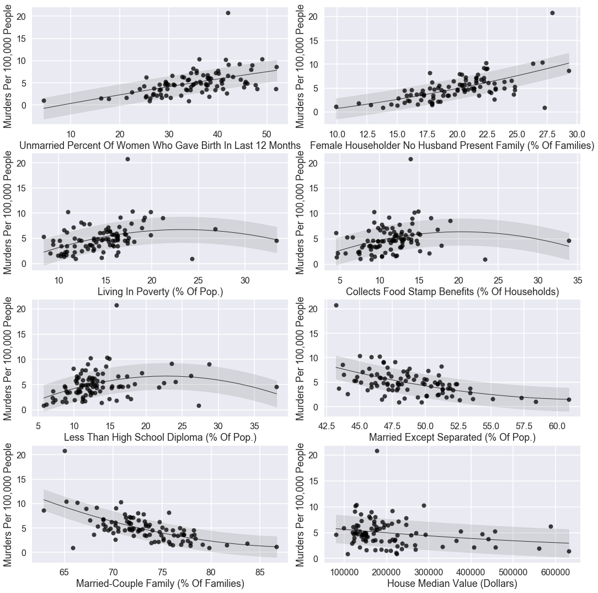


### Check Very Strong Correlations


```python
corrs = df_2010.corr().abs()
```


```python
cols_using = ['family_households_married-couple_family',
              'family_household_married_couple_family_with_own_children_under_18_years',
              'family_households_female_householder_no_husband_present',
              'family_households_female_householder_no_husband_present_with_own_children_under_18',
              'now_married_except_separated',
              'less_than_high_school_diploma',
              'high_school_graduate_or_higher',
              'unmarried_portion_of_women_15_to_50_years_who_had_a_birth_in_past_12_months',
              'civilian_noninst_population_18_to_64_years_with_a_disability',
              'civilian_noninst_population_65_years_and_older_with_a_disability',
              'industry_transportation_and_warehousing_and_utilities',
              'median_household_income_(dollars)',
              'households_with_supplemental_security_income',
              'households_with_food_stamp_snap_benefits',
              'median_family_income_(dollars)',
              'percentage_married-couple_family',
              'percentage_female_householder_no_husband_present_family',
              'poverty_all_families',
              'poverty_all_families_with_related_children_under_18_years',
              'poverty_all_families_with_related_children_under_18_years_with_related_children_under_5_years_only',
              'poverty_all_people',
              'poverty_65_years_and_over',
              'no_telephone_service_available',
              'house_median_value_(dollars)',
              'murder_per_100_k'
             ]
```


```python
cols_important = ['now_married_except_separated',
                  'less_than_high_school_diploma',
                  'unmarried_women_who_had_a_birth_in_past_12_months',
                  'households_with_food_stamp_snap_benefits',
                  'percentage_married-couple_family',
                  'percentage_female_householder_no_husband_present_family',
                  'poverty_all_people',
                  'house_median_value_(dollars)',
                  'murder_per_100_k'
]
```


    /Users/ilanjdor/anaconda/lib/python3.6/site-packages/seaborn/categorical.py:1428: FutureWarning: remove_na is deprecated and is a private function. Do not use.
      stat_data = remove_na(group_data)


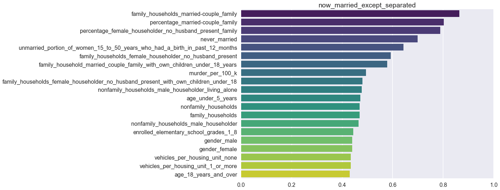


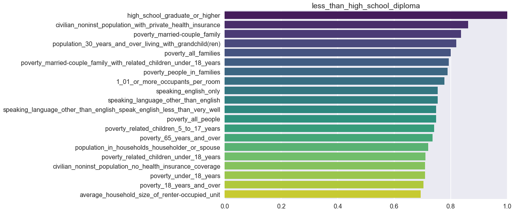


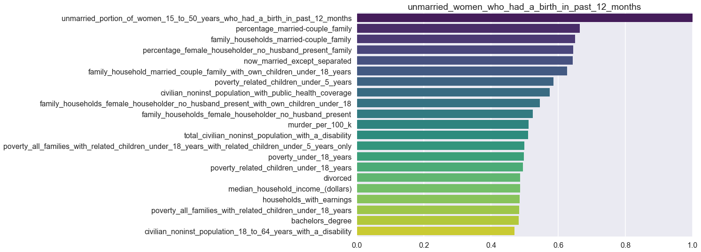


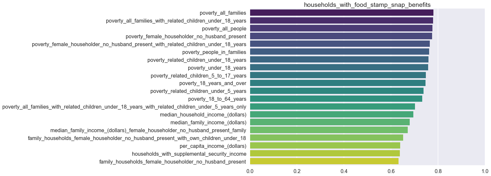


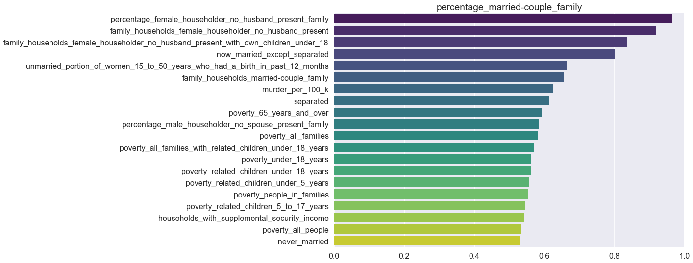


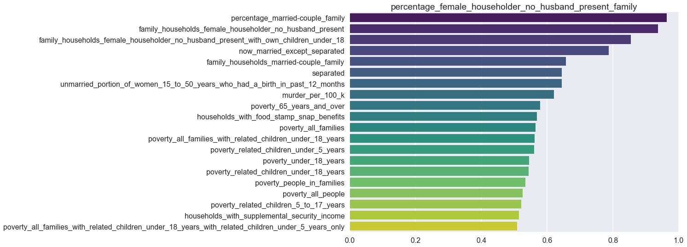


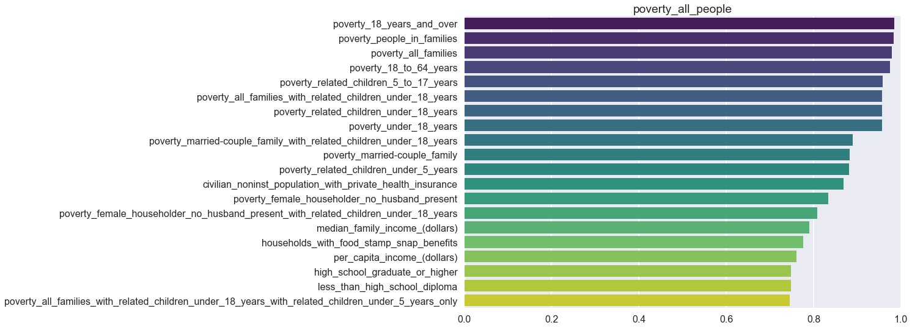


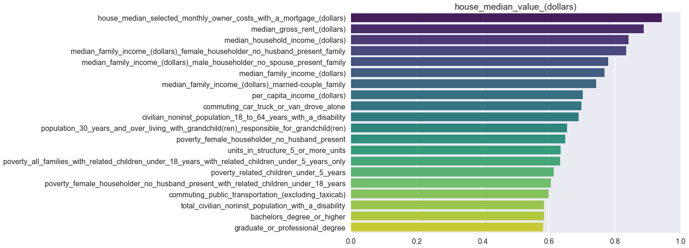


    /Users/ilanjdor/anaconda/lib/python3.6/site-packages/seaborn/categorical.py:1428: FutureWarning: remove_na is deprecated and is a private function. Do not use.
      stat_data = remove_na(group_data)


### Correlation Heatmap


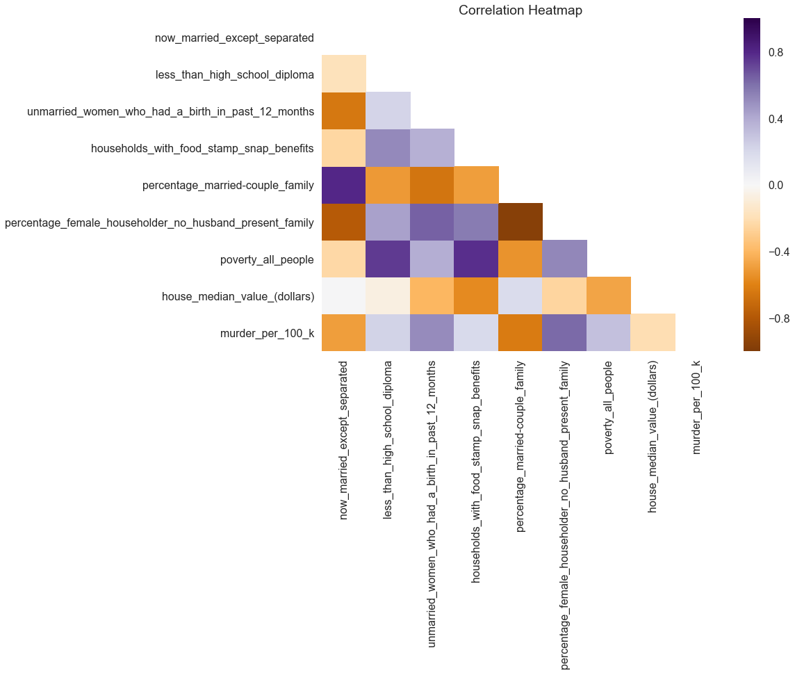


## EDA on All Data

### Data Import


```python
df_all = pd.read_csv('../data/merged/all_data_2006_to_2016.csv')
df_all.info()
```


    <class 'pandas.core.frame.DataFrame'>
    RangeIndex: 928 entries, 0 to 927
    Data columns (total 13 columns):
    MSA_orig                                                                       928 non-null object
    MSA_corr                                                                       928 non-null object
    MSA_abbr                                                                       928 non-null object
    year                                                                           928 non-null int64
    now_married_except_separated                                                   928 non-null float64
    less_than_high_school_diploma                                                  928 non-null float64
    unmarried_portion_of_women_15_to_50_years_who_had_a_birth_in_past_12_months    928 non-null float64
    households_with_food_stamp_snap_benefits                                       928 non-null float64
    percentage_married-couple_family                                               928 non-null float64
    percentage_female_householder_no_husband_present_family                        928 non-null float64
    poverty_all_people                                                             928 non-null float64
    house_median_value_(dollars)                                                   928 non-null int64
    murder_per_100_k                                                               928 non-null float64
    dtypes: float64(8), int64(2), object(3)
    memory usage: 94.3+ KB


### Histogram


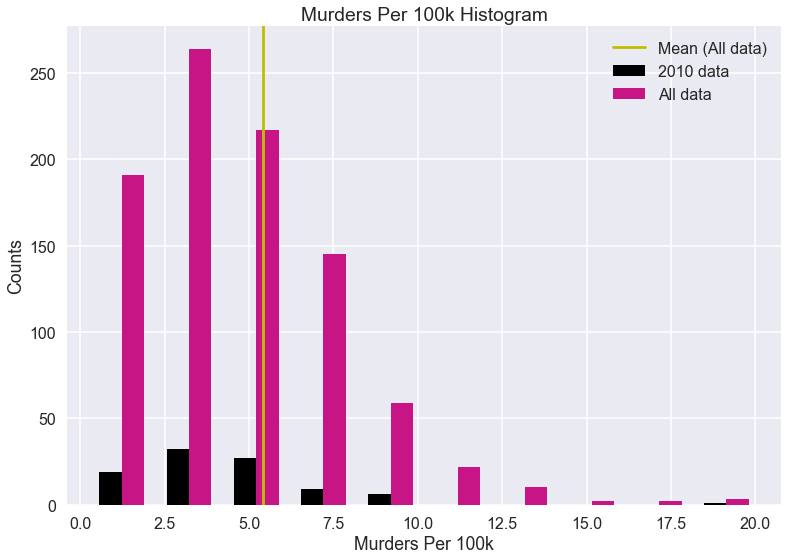


### Scatter Plots


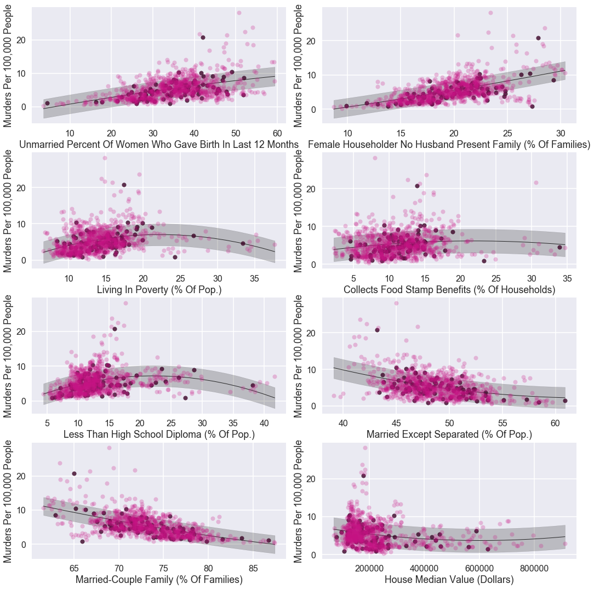
