## Contents
{:.no_toc}
*  
{: toc}


# EDA


    <IPython.core.display.Javascript object>


### Preliminary EDA on 2010 data

#### Data import


    <class 'pandas.core.frame.DataFrame'>
    RangeIndex: 94 entries, 0 to 93
    Columns: 191 entries, year to murder_per_100_k
    dtypes: float64(173), int64(17), object(1)
    memory usage: 140.3+ KB


#### Histogram


```python
with sns.axes_style("darkgrid"):
    plt.hist(df_2010.murder_per_100_k.values, bins=50, facecolor='black')
    plt.axvline(df_2010.murder_per_100_k.mean(), 0, 1, color='r', label='Mean')
    plt.xlabel("Murders Per 100k")
    plt.ylabel("Counts")
    plt.title("Murders Per 100k Histogram")
    plt.legend()
```


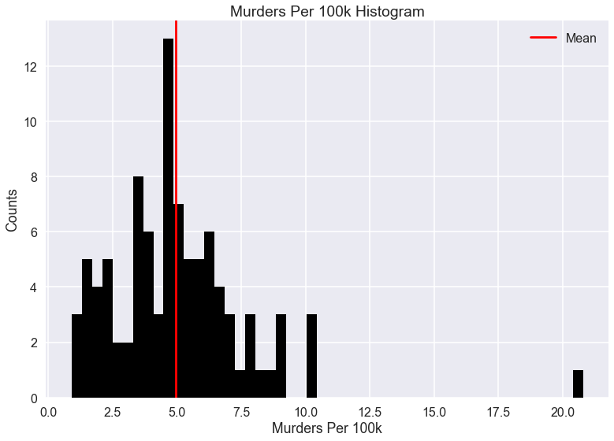


```python
relevant_cols = ['family_households_married-couple_family',
                 'family_household_married_couple_family_with_own_children_under_18_years',
                 'family_households_female_householder_no_husband_present',
                 'family_households_female_householder_no_husband_present_with_own_children_under_18',
                 'now_married_except_separated',
                 'less_than_high_school_diploma',
                 'high_school_graduate_or_higher',
                 'unmarried_portion_of_women_15_to_50_years_who_had_a_birth_in_past_12_months',
                 'civilian_noninst_population_18_to_64_years_with_a_disability',
                 'civilian_noninst_population_65_years_and_older_with_a_disability',
                 'industry_transportation_and_warehousing_and_utilities',
                 'median_household_income_(dollars)',
                 'households_with_supplemental_security_income',
                 'households_with_food_stamp_snap_benefits',
                 'median_family_income_(dollars)',
                 'percentage_married-couple_family',
                 'percentage_female_householder_no_husband_present_family',
                 'poverty_all_families',
                 'poverty_all_families_with_related_children_under_18_years',
                 'poverty_all_families_with_related_children_under_18_years_with_related_children_under_5_years_only',
                 'poverty_all_people',
                 'poverty_65_years_and_over',
                 'no_telephone_service_available',
                 'house_median_value_(dollars)',
                 'murder_per_100_k']
```


```python
selected_cols = ['unmarried_portion_of_women_15_to_50_years_who_had_a_birth_in_past_12_months',
                 'percentage_female_householder_no_husband_present_family',
                 'poverty_all_people',
                 'households_with_food_stamp_snap_benefits',
                 'less_than_high_school_diploma',
                 'now_married_except_separated',
                 'percentage_married-couple_family',
                 'house_median_value_(dollars)',
                 'murder_per_100_k']
```


```python
selected_col_x_vals = ['Unmarried Percent Of Women Who Gave Birth In Last 12 Months',
                       'Female Householder No Husband Present Family (% Of Families)',
                       'Living In Poverty (% Of Pop.)',
                       'Collects Food Stamp Benefits (% Of Households)',
                       'Less Than High School Diploma (% Of Pop.)',
                       'Married Except Separated (% Of Pop.)',
                       'Married-Couple Family (% Of Families)',
                       'House Median Value (Dollars)',
                       'Murders Per 100,000 People']
```


#### Scatter plots


```python
fig, ax = plt.subplots(4, 2, figsize=(15, 15))
plt.tight_layout()
x_vals = np.linspace(0, 1, 100)
x_vals = x_vals.reshape(len(x_vals),1)
ax = ax.ravel()
y = df_2010.murder_per_100_k
for i in range(0, len(selected_cols)-1):
    x = df_2010[selected_cols[i]]
    params = np.polyfit(x, y, 2)
    xp = np.linspace(x.min(), x.max(), 20)
    yp = np.polyval(params, xp)
    ax[i].plot(xp, yp, 'k', alpha=0.8, linewidth=1)
    ax[i].plot(x, y, 'o', markersize=8, alpha=0.75, color='black')
    sig = np.std(y - np.polyval(params, x))
    ax[i].fill_between(xp, yp - sig, yp + sig, color='gray', alpha=0.2)
    ax[i].set_xlabel(selected_col_x_vals[i])
    ax[i].set_ylabel(selected_col_x_vals[-1])
```


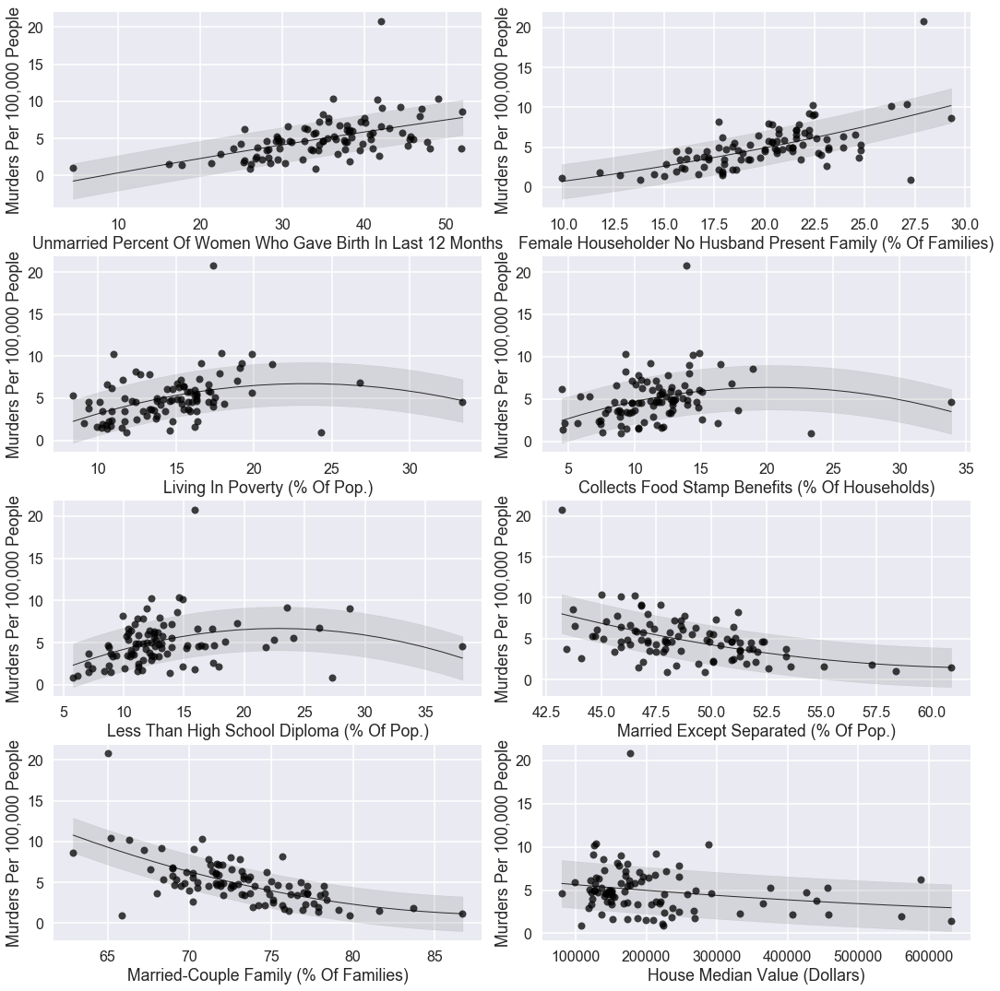


#### Check very strong correlations


```python
corrs = df_2010.corr().abs()
```


```python
cols_using = ['family_households_married-couple_family',
              'family_household_married_couple_family_with_own_children_under_18_years',
              'family_households_female_householder_no_husband_present',
              'family_households_female_householder_no_husband_present_with_own_children_under_18',
              'now_married_except_separated',
              'less_than_high_school_diploma',
              'high_school_graduate_or_higher',
              'unmarried_portion_of_women_15_to_50_years_who_had_a_birth_in_past_12_months',
              'civilian_noninst_population_18_to_64_years_with_a_disability',
              'civilian_noninst_population_65_years_and_older_with_a_disability',
              'industry_transportation_and_warehousing_and_utilities',
              'median_household_income_(dollars)',
              'households_with_supplemental_security_income',
              'households_with_food_stamp_snap_benefits',
              'median_family_income_(dollars)',
              'percentage_married-couple_family',
              'percentage_female_householder_no_husband_present_family',
              'poverty_all_families',
              'poverty_all_families_with_related_children_under_18_years',
              'poverty_all_families_with_related_children_under_18_years_with_related_children_under_5_years_only',
              'poverty_all_people',
              'poverty_65_years_and_over',
              'no_telephone_service_available',
              'house_median_value_(dollars)',
              'murder_per_100_k'
             ]
```


    Index(['family_households_married-couple_family',
           'family_household_married_couple_family_with_own_children_under_18_years',
           'family_households_female_householder_no_husband_present',
           'family_households_female_householder_no_husband_present_with_own_children_under_18',
           'now_married_except_separated', 'less_than_high_school_diploma',
           'high_school_graduate_or_higher',
           'unmarried_women_who_had_a_birth_in_past_12_months',
           'civilian_noninst_population_18_to_64_years_with_a_disability',
           'civilian_noninst_population_65_years_and_older_with_a_disability',
           'industry_transportation_and_warehousing_and_utilities',
           'median_household_income_(dollars)',
           'households_with_supplemental_security_income',
           'households_with_food_stamp_snap_benefits',
           'median_family_income_(dollars)', 'percentage_married-couple_family',
           'percentage_female_householder_no_husband_present_family',
           'poverty_all_families',
           'poverty_all_families_with_related_children_under_18_years',
           'poverty_all_families_with_related_children_under_18_years_with_related_children_under_5_years_only',
           'poverty_all_people', 'poverty_65_years_and_over',
           'no_telephone_service_available', 'house_median_value_(dollars)',
           'murder_per_100_k'],
          dtype='object')


```python
cols_important = [
    'now_married_except_separated',
    'less_than_high_school_diploma',
    'unmarried_women_who_had_a_birth_in_past_12_months',
    'households_with_food_stamp_snap_benefits',
    'percentage_married-couple_family',
    'percentage_female_householder_no_husband_present_family',
    'poverty_all_people',
    'house_median_value_(dollars)',
    'murder_per_100_k'
]
```


```python
n_plots = len(cols_important)

for i,f in enumerate(cols_important):
    items = feat[f]
    labels = list(zip(*items))[0]
    scores = list(zip(*items))[1]

    if True:
        plt.figure(i)
        
    sns.barplot(scores, labels, palette='viridis')
    plt.xlim(0.,1.0)
    plt.title(f)
```


    /Users/ilanjdor/anaconda/lib/python3.6/site-packages/seaborn/categorical.py:1428: FutureWarning: remove_na is deprecated and is a private function. Do not use.
      stat_data = remove_na(group_data)


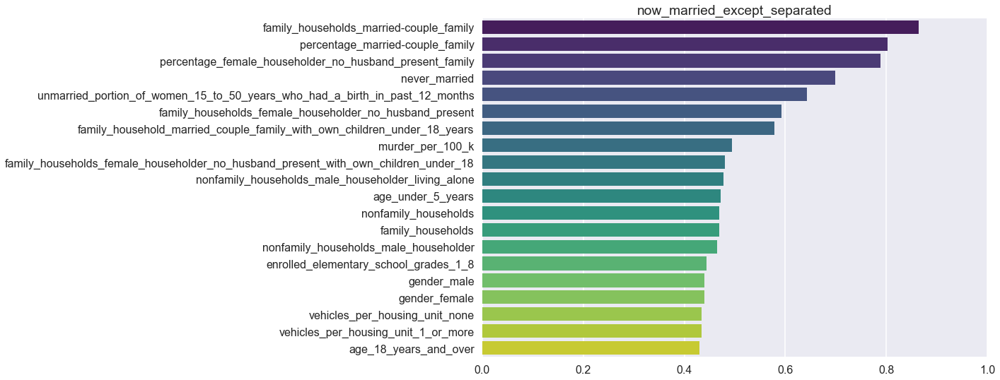


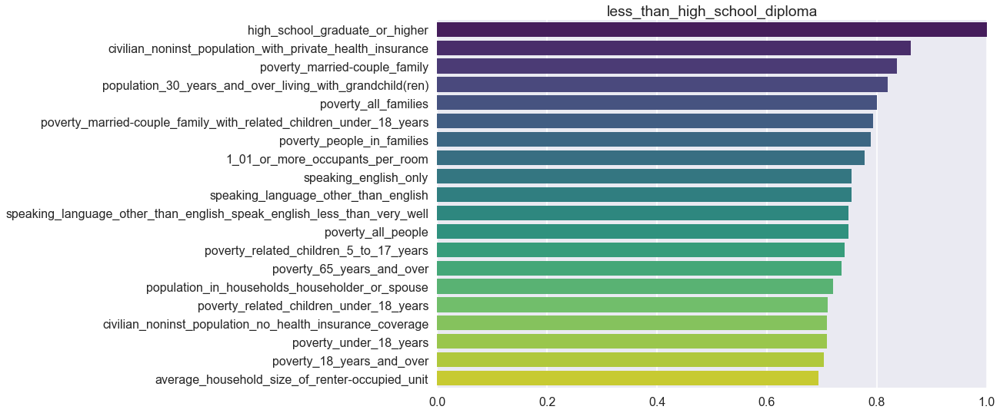


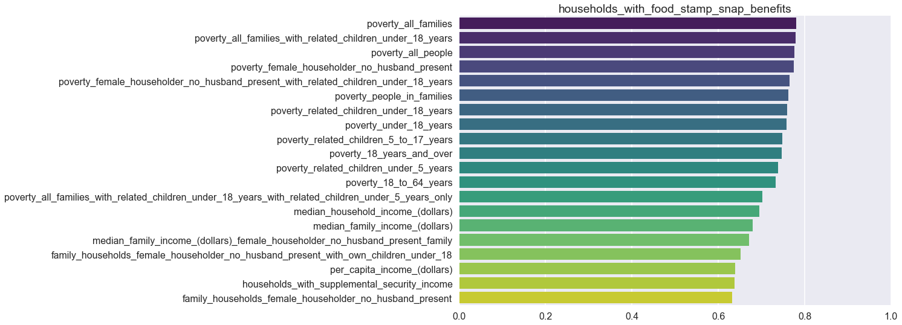


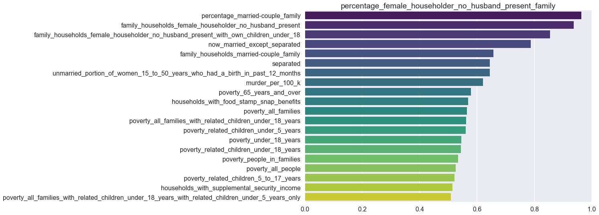


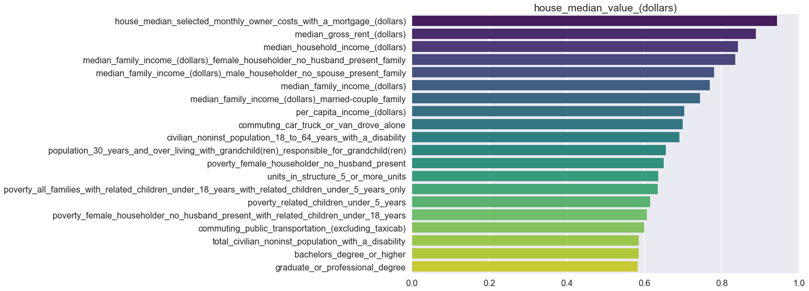


```python
items = feat['murder_per_100_k']
labels = list(zip(*items))[0]
scores = list(zip(*items))[1]

sns.barplot(scores, labels, palette='viridis')
plt.xlim(0.,1.0)
plt.title('Magnitude of Correlation with Murder Rate');
```


    /Users/ilanjdor/anaconda/lib/python3.6/site-packages/seaborn/categorical.py:1428: FutureWarning: remove_na is deprecated and is a private function. Do not use.
      stat_data = remove_na(group_data)


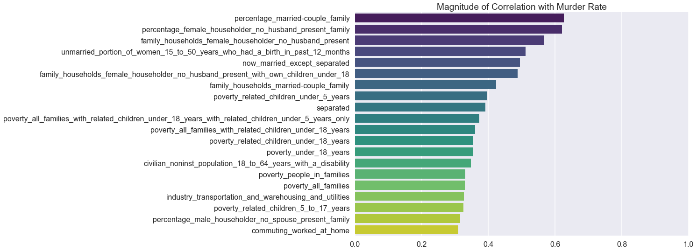


#### Correlation heatmap


```python
mask = np.zeros_like(df_used.corr())
mask[np.triu_indices_from(mask)] = True
with sns.axes_style("white"):
    sns.heatmap(df_used.corr(), cmap='PuOr', mask=mask)
    plt.title('Correlation Heatmap');
```


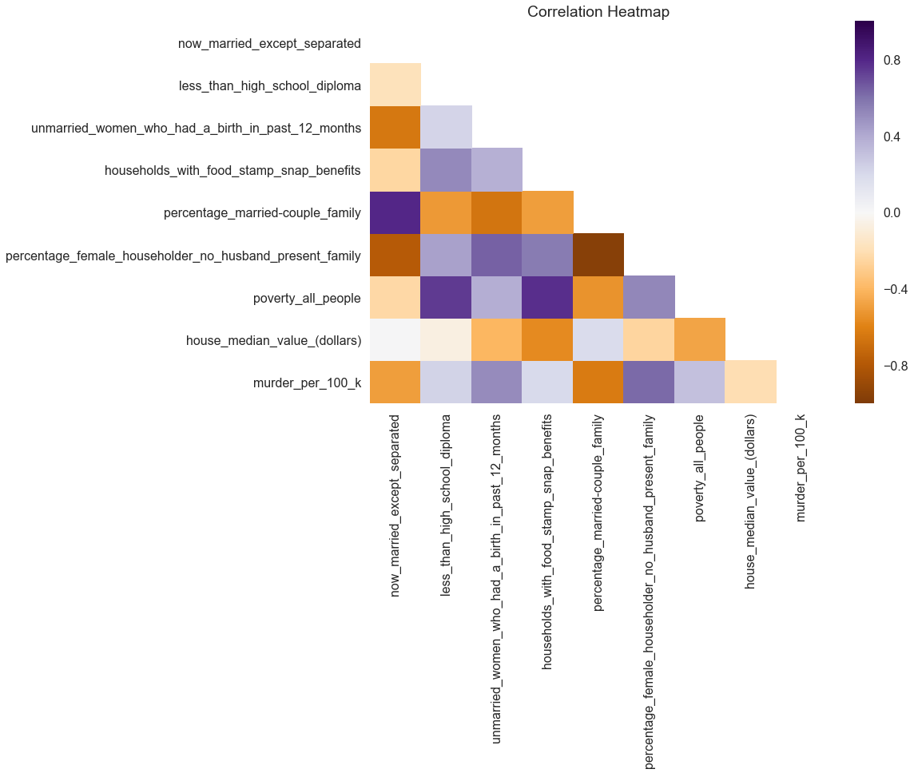


### EDA on all data

#### Data import


    <class 'pandas.core.frame.DataFrame'>
    RangeIndex: 928 entries, 0 to 927
    Data columns (total 13 columns):
    MSA_orig                                                                       928 non-null object
    MSA_corr                                                                       928 non-null object
    MSA_abbr                                                                       928 non-null object
    year                                                                           928 non-null int64
    now_married_except_separated                                                   928 non-null float64
    less_than_high_school_diploma                                                  928 non-null float64
    unmarried_portion_of_women_15_to_50_years_who_had_a_birth_in_past_12_months    928 non-null float64
    households_with_food_stamp_snap_benefits                                       928 non-null float64
    percentage_married-couple_family                                               928 non-null float64
    percentage_female_householder_no_husband_present_family                        928 non-null float64
    poverty_all_people                                                             928 non-null float64
    house_median_value_(dollars)                                                   928 non-null int64
    murder_per_100_k                                                               928 non-null float64
    dtypes: float64(8), int64(2), object(3)
    memory usage: 94.3+ KB


#### Histogram


```python
with sns.axes_style("darkgrid"):
    np.random.seed(0)
    fig, ax = plt.subplots()

    a_heights, a_bins = np.histogram(df_2010['murder_per_100_k'])
    b_heights, b_bins = np.histogram(df_all['murder_per_100_k'], bins=a_bins)

    width = (a_bins[1] - a_bins[0])/3

    ax.bar(a_bins[:-1], a_heights, width=width, facecolor='black',
           label='2010 data')
    ax.bar(b_bins[:-1]+width, b_heights, width=width, facecolor='mediumvioletred',
           label='All data')
    plt.axvline(df_all.murder_per_100_k.mean(), 0, 1, color='y', label='Mean (All data)')
    plt.xlabel("Murders Per 100k")
    plt.ylabel("Counts")
    plt.title("Murders Per 100k Histogram")
    plt.legend()
```


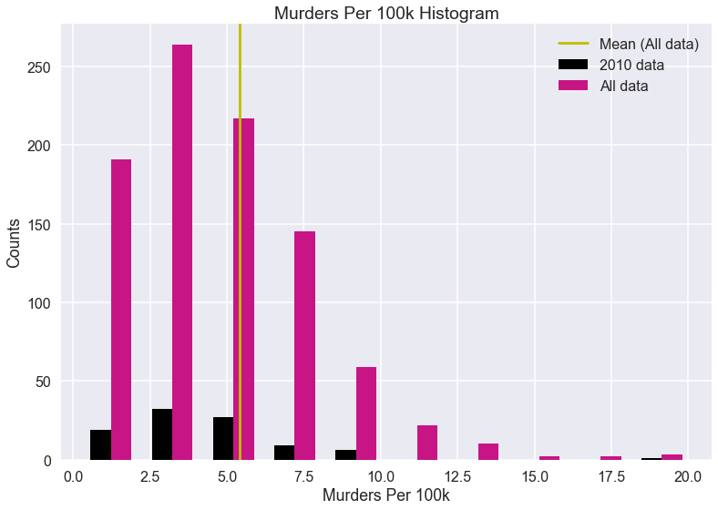


#### Scatter plots


```python
fig, ax = plt.subplots(4, 2, figsize=(15, 15))
plt.tight_layout()
x_vals = np.linspace(0, 1, 100)
x_vals = x_vals.reshape(len(x_vals),1)
ax = ax.ravel()
y_2010 = df_2010.murder_per_100_k
y_all = df_all.murder_per_100_k
for i in range(0, len(selected_cols)-1):
    x_2010 = df_2010[selected_cols[i]]
    x_all = df_all[selected_cols[i]]
    params = np.polyfit(x_all, y_all, 2)
    xp_all = np.linspace(x_all.min(), x_all.max(), 20)
    yp_all = np.polyval(params, xp_all)
    ax[i].plot(x_2010, y_2010, 'o', markersize=8, alpha=0.75, color='black')
    ax[i].plot(xp_all, yp_all, 'k', alpha=0.8, linewidth=1)
    ax[i].plot(x_all, y_all, 'o', markersize=8, alpha=0.25, color='mediumvioletred')
    sig = np.std(y_all - np.polyval(params, x_all))
    ax[i].fill_between(xp_all, yp_all - sig, yp_all + sig, color='k', alpha=0.2)
    ax[i].set_xlabel(selected_col_x_vals[i])
    ax[i].set_ylabel(selected_col_x_vals[-1])
```


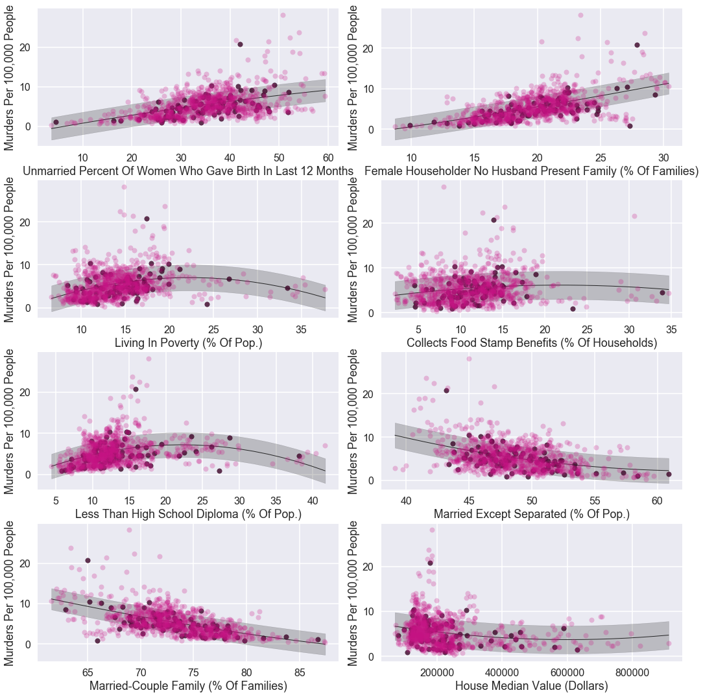


<div>
<style scoped>
    .dataframe tbody tr th:only-of-type {
        vertical-align: middle;
    }

    .dataframe tbody tr th {
        vertical-align: top;
    }

    .dataframe thead th {
        text-align: right;
    }
</style>
<table border="1" class="dataframe">
  <thead>
    <tr style="text-align: right;">
      <th></th>
      <th>dataset</th>
      <th>now_married_except_separated</th>
      <th>less_than_high_school_diploma</th>
      <th>unmarried_portion_of_women_15_to_50_years_who_had_a_birth_in_past_12_months</th>
      <th>households_with_food_stamp_snap_benefits</th>
      <th>percentage_married-couple_family</th>
      <th>percentage_female_householder_no_husband_present_family</th>
      <th>poverty_all_people</th>
      <th>house_median_value_(dollars)</th>
      <th>murder_per_100_k</th>
    </tr>
  </thead>
  <tbody>
    <tr>
      <th>0</th>
      <td>2010</td>
      <td>47.9</td>
      <td>10.7</td>
      <td>41</td>
      <td>12.9</td>
      <td>73.7</td>
      <td>19.8</td>
      <td>15.5</td>
      <td>145000</td>
      <td>3.7</td>
    </tr>
    <tr>
      <th>1</th>
      <td>2010</td>
      <td>46.7</td>
      <td>8.9</td>
      <td>26.2</td>
      <td>10.3</td>
      <td>76.1</td>
      <td>17.9</td>
      <td>11.5</td>
      <td>199000</td>
      <td>1.5</td>
    </tr>
    <tr>
      <th>2</th>
      <td>2010</td>
      <td>46.9</td>
      <td>13.2</td>
      <td>44.6</td>
      <td>12.1</td>
      <td>69</td>
      <td>20.6</td>
      <td>17.2</td>
      <td>183300</td>
      <td>5.8</td>
    </tr>
    <tr>
      <th>3</th>
      <td>2010</td>
      <td>51.3</td>
      <td>12.3</td>
      <td>37.7</td>
      <td>9.8</td>
      <td>76.2</td>
      <td>17.2</td>
      <td>11.7</td>
      <td>218700</td>
      <td>3.5</td>
    </tr>
    <tr>
      <th>4</th>
      <td>2010</td>
      <td>48.7</td>
      <td>12.5</td>
      <td>37.9</td>
      <td>11.3</td>
      <td>71.6</td>
      <td>21.6</td>
      <td>14.8</td>
      <td>175900</td>
      <td>6.1</td>
    </tr>
  </tbody>
</table>
</div>


#### Pair plots


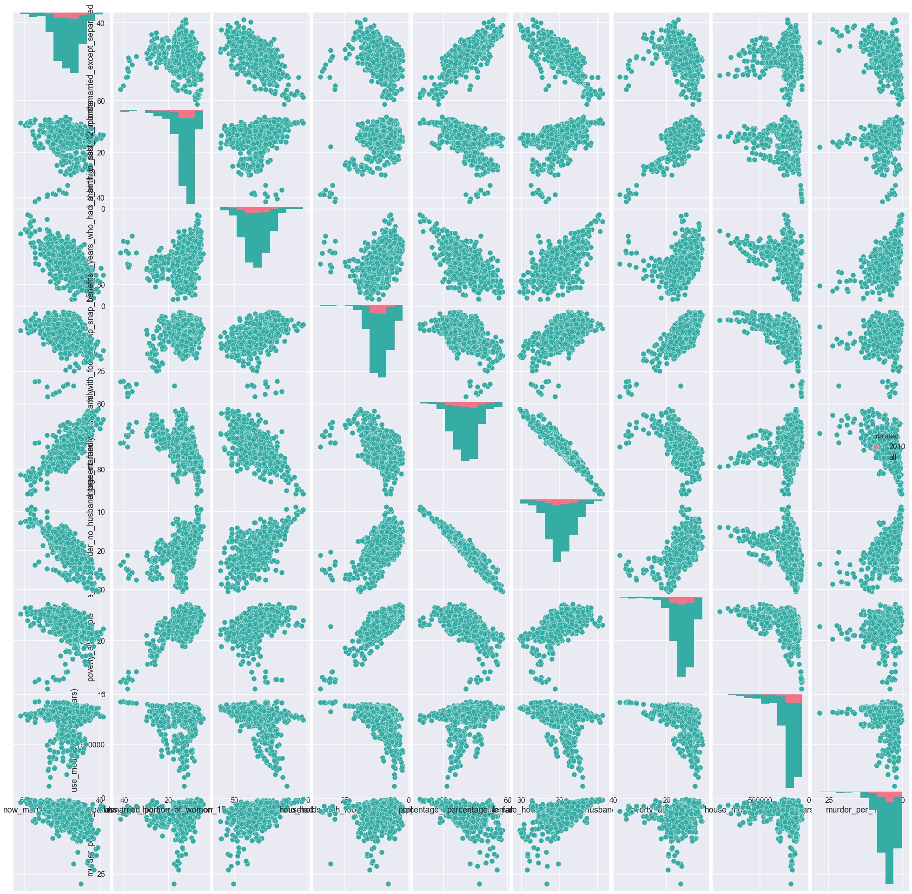


    0 hrs 0 mins 48 secs

