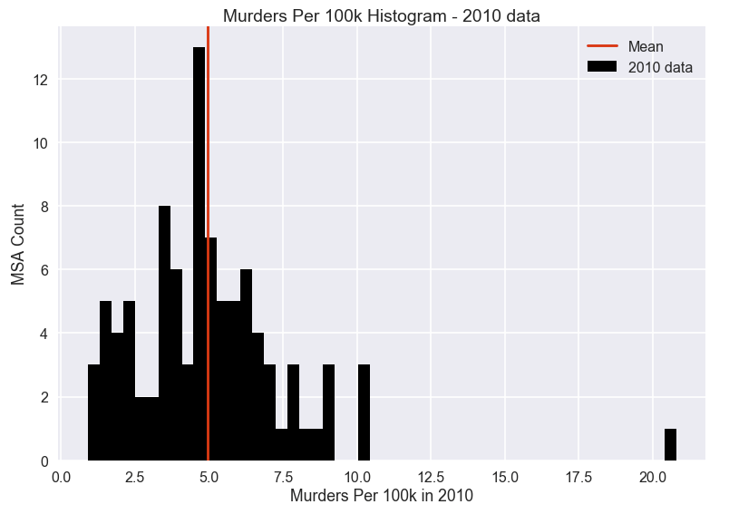
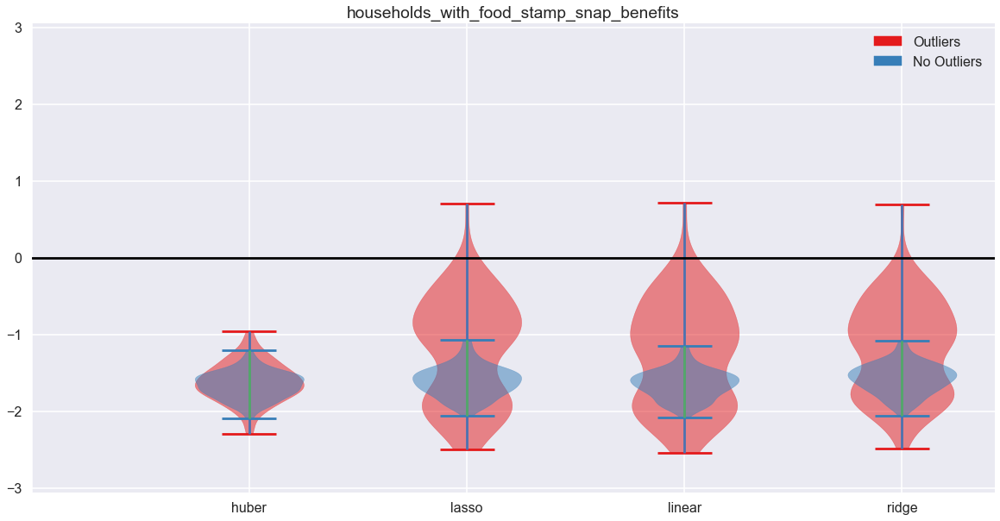
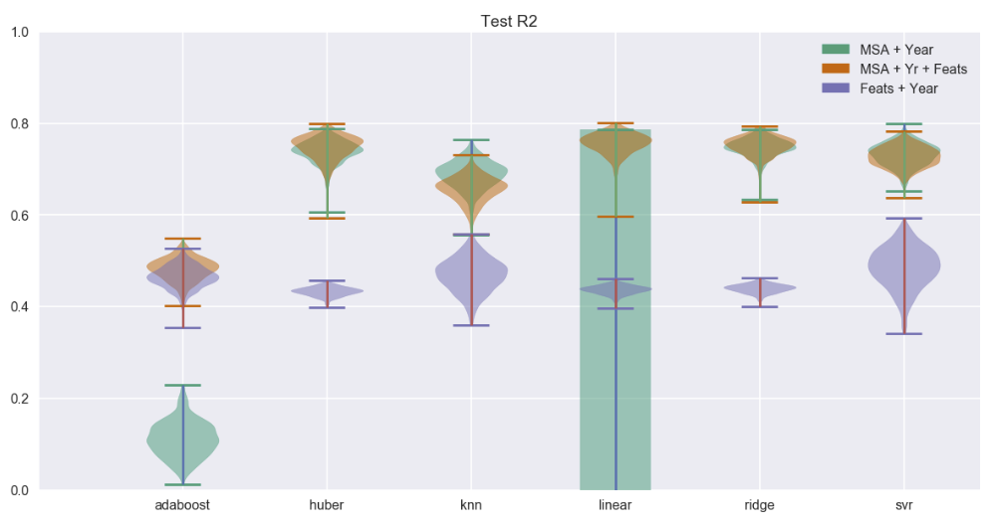
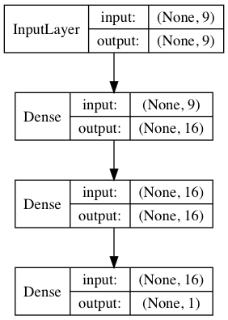

> **Created by Team 14:** *David Loving* \| *Ilan Dor* \| *Volodymyr Popil*

### Problem Statement and Motivation
Our goal was to lay the groundwork for future research and public policy decisions by analyzing the degree to which current data sources can provide explanations for variation in violent crime rates. If we can show that the current data has strong predictive power, it would suggest that further research with that data may be able to establish causitive factors of violent crime and to guide public policy. If, on the other hand, the available data has no or weak predictive power, it would support an investment in gathering more data in order to enable research on causitive factors. The core motivation behind our goal rests in the simple fact that violent crime is and has always been a most tragic and detrimental part of society and people's lives, and we believe that with enough knowledge it can be reduced if not eliminated.

### Introduction and Description of Data
Building an understanding of violent crime enables policy makers to make informed decisions to reduce incidents of violence. We focus on murder as a proxy for violent crime. Although murder is an outlier of criminal behavior, murder has a clear and consistent definition nationally (and frequently internationally) while being reported reliably. This reliability and consistency makes murder rate a good metric.

Murder is a relatively (although not absolutely) rare occurrence. That is, while many people get murdered each year, most people die from causes other than murder. Gaining scientific insight into this particular crime is challenging due to its relative infrequency. Furthermore, murder is often a highly personal crime whose circumstances vary widely by instance. It is not clear to what degree we can build the necessary insight using the data that is currently being collected, and so we must answer whether it is reasonable to embark on a major research project with such data or not. This project is an important first step as it provides direction for further work.

 For our analysis, we needed two main datasets: one consisting of violent crimes (including murder rate) in each MSA (metropolitan statistical area) and another consisting of Census data about the same MSAs. The murder rates, by MSA and year, were scraped from the `ucr.fbi.gov` website (accounting for differences by year in website URL format and HTML table tags), Census data was downloaded from the `factfinder.census.gov` website and CSV files were imported into a Python script. Note that the FBI does not provide a standalone rate for murder, only; the rate they provide includes both murders as well as instances of non-negligent manslaughter. It is this rate that we are referring to whenever we discuss or model the 'murder' rate.

There were numerous inconsistencies in data between years. For example, the number of features varies from year to year, as does the metadata, so we decided to fetch only 2010 (chosen arbitrarily) to perform our preliminary EDA. The subset of features was selected (excluding only some extremely redundant features) and renamed for better readability. 

After looking at a histogram which showed us a roughly normal-looking distribution of murder rates across the various MSAs with a mean of around 5 per 100,000 inhabitants, we moved our focus towards scatter plots of 190 features all taken against murder rate. From a careful visual analysis of these as well some subjective work on forming a reasonable and varied set of predictors, we narrowed that large collection of features down to about 25. Repeating a similar analysis and scrutiny, we arrived at a selection of eight features (in addition to MSA and year) to be used in our modeling:

- now_married_except_separated
- less_than_high_school_diploma
- unmarried_portion_of_women_15_to_50_years_who_had_a_birth_in_past_12_months
- households_with_food_stamp_snap_benefits
- percentage_married-couple_family
- percentage_female_householder_no_husband_present_family
- poverty_all_people
- house_median_value_(dollars)

There is significant colinearity between some of these features as well as those features not selected, and feature selection was not performed with a rigorous method. Because our problem is to assess the predictive power of the data rather than conclusively isolate the effects of individual features or to establish causation, colinearity and selection of the most powerful is less important than using a small number (to reduce overfitting) of representative features. We were also limited by the large amount of manual work required to match a large number of differently-named features across years when scraping the data, and so a representative subset of the population of census features was a practical necessity.

For these eight features, we merged (on MSA name) the two datasets described above to create a dataset on the matching rows, only. The FBI and Census have different sets of MSAs, so we used the smaller set (Census) and most matched perfectly to the FBI data, while leaving some of the FBI data points unused. This approach seems appropriate as it is not possible to match certain FBI listed MSAs to Census data if those are not available.

We noticed that some MSAs had similar but different names across years. In every case where we believed the MSA to represent either mostly or exactly the same geographical area, we chose a single name for that MSA to use across all years of data provided for it. For the sake of transparency, we have included in our merged dataset both the original MSA name ('MSA_orig') as well as the revised/corrected one ('MSA_corr'), so that you can see where and how MSA names were revised. Additionally, for technical convenience, we added a column named 'MSA_abbr' to contain a much shorter version of each MSA name in a contiguous and highly-consistent format. This was particularly helpful for one-hot encoding the MSAs. For example, here is the set of these names that applied (for 2016) for the Denver, CO MSA:

MSA_orig|MSA_corr|MSA_abbr|year
---|---|---|---
Denver-Aurora-Lakewood, CO|Denver-Aurora, CO|DENVER_CO|2016

### Literature Review / Related Work

We gained general insight into recent violent crime trends from a Congressional Research Report, [Is Violent Crime in the United States Increasing?](https://fas.org/sgp/crs/misc/R44259.pdf) by Nathan James (2015). James establishes that national homicide and violent crime rates have been trending downward since 1990, and that there was not in 2015 statistically significant evidence to believe that this trend has reversed. This informs our decision to use year as a continuous predictor in order to capture the overall national trend. Although James enumerates some reasons that individual cities may show trends that differ from the national trend, we do not model this because we are more interested in explaining this divergence than using observed divergences.

We took our moving average approach from the Wikipedia page for that topic: 

https://en.wikipedia.org/wiki/Moving_average

It mentioned that "in science and engineering the mean is normally taken from an equal number of data on either side of a central value. This ensures that variations in the mean are aligned with the variations in the data rather than being shifted in time." Therefore, this is the approach that we used in our temporal modeling.

### Modeling Approach and Project Trajectory

#### Modeling Outlier Effects

We began the modeling phase by first splitting our merged dataset into train and test sets. We conducted a random 70/30 split for train and test, respectively.

During our EDA, we noticed a few observations with particularly high murder rates. Comparing coefficient confidence intervals of OLS and Huber models, we found that Huber strongly outperformed OLS. This indicated that our OLS estimator was being influenced by the presence of outliers. Therefore, we created a second train/test set by removing those outliers from our existing train/test set (without performing a re-split).

For our baseline modeling, we used a dictionary approach which allowed us to run a series of models in a somewhat side-by-side progression. For a large number of bootstrapped samples, we fit and evaluated Linear, Ridge, Huber, k-NN, Adaboost and SVR (support vector regression) models in this initial stage of modeling. For all models except Linear, on each bootstrap sample we used cross-validation for parameter tuning and to prevent overfitting. Each bootstrap sample was passed to all of the models so that they received identical training data, and then the fitted models were scored on the original training and test sets.

We ran each of these models on both the full and sans-outliers train datasets in order to compare the effect of removing outliers. We also ran linear regression models (Huber, Lasso, Ridge, and OLS) in the same way, and evaluated how the removal of outliers affected the distribution of coefficients.

After removing outliers, we found that train and test scores generally both increased and their distributions tightened, indicating a better predictive ability. Similarly, the distributions of coefficients of linear models tightened (dramatically in some cases). This suggested that when we evaluate coefficient significance, by removing outliers we may be able to reject the null hypothesis much more readily. This provides a strong reason to continue our experiments with the no-outliers sets.

#### Modeling Feature Subsets

Next, we decided to examine the differences between including/excluding, in our modeling, MSA, year and/or the remaining features. More specifically, we looked at the following subsets:
- MSA + Year
- MSA + Year + Features
- Features + Year

We use the year feature to allow our models to represent national trends over time, and include it in all of our subsets.

By one-hot-encoding MSAs we create a bucket that represents all of the ways in which MSAs differ from each other (in aggregate, over the years observed), including those variables that are represented in our selected features or even in the larger set of census data. This should allow very high performance because it contains all of the non-temporal variation between observations, and we consider it our "golden standard".

Our census feature selection is the core interest. By examining how a model fitted only on these features (and the year) compares to being fitted on the MSA-encodings we can determine whether our census features contain latent information about the causes of murder rate variance. A strong performance relative to the MSA-encodings means that the census data has strong ability to explain murder rates and is an encouragement to future work with that data. A weak performance here would indicate that a more sophisticated model is required, we have made very poor choices for our feature selection, or that the census data is insufficient for understanding murder rates.

Given our results from modeling the effects of outliers, we excluded them from all models going forward, including here. For the `MSA + Year` and `MSA + Year + Features` datasets, we one-hot encoded `MSA`. For the `MSA + Year + Features` and `Features + Year` datasets, we standardized the features (based on the previously-determined sans-outliers training data, only). For all three datasets, we rescaled `Year` (also based on the previously-determined sans-outliers training data, only) to approximately [0.1 , 1.0] to resemble the `MSA` encoding scale. Then, for each of these datasets, we split the data into train and test datasets using the same sans-outliers train/test split determined earlier.

Our procedure is similar to that used before, with Linear, Ridge, Huber, k-NN, Adaboost and SVR models fitting to bootstrapped samples of each of the three datasets. For all models except Linear, we used cross-validation to prevent overfitting and for parameter tuning. We evaluate model performance on the original training and test datassets.

For all models, train and test set performance is similar enough that we are not concerned that overfitting has ocurred. An important note is that the OLS model consistently fails to produce logical results on the `MSA + Year` set, possibly due to numerical instability or a bug in the solver. We observe that `MSA + Year` and `MSA + Year + Features` are very similar, confirming our hypothesis on the usefulness of MSA-encodings as buckets of all MSA-level variables (with the notable exception of Adaboost).

Fitted on `Features + Year` only, our models reach more than half of the performance of our MSA-encoded models. This is very encouraging, as it proves the census data has the ability to explain at least a significant amount of violent crime. This is only a baseline measure of performance, and does not represent a maximum. Comparing the performance between the models, we see that those that can represent nonlinearities (Adaboost, k-NN, SVR) achieve somewhat better results than the linear models which suggests nonlinear relationships as one avenue of further exploration.

#### Modeling Temporal Effects
Next, we decided to examine temporal effects. We analyzed the following subsets:
- Including MSA (MSA + Year + Features)
- Excluding MSA (Features + Year)

In order to model the temporal effects, we smoothed the features using a moving average. Due to how this method works, it was necessary to use a train/test split at a point in time rather than randomly (as we did in all of our other models). We chose a split year of 2013, thereby including all data sans outliers from 2006-2013 in our train dataset and all data sans outliers from 2014-2016 in our test dataset. For the dataset inclusive of `MSA`, we one-hot encoded `MSA`. We standardized the features (based on the newly-determined training data, only).

We used a simple 5-year moving average to smooth the features in the train data, only. We took an equal number of years on either side of the observation year to average across. So, for example, if the observation year was 2013 for the Denver MSA, we would have averaged the 2011 through 2015 observations for Denver, insofar as each was available. Missing/skipped observation years were simply not included in the averages. The same handling was applied to years near the beginning or end of the dataset. We smooth the features in the train data, only, because the train data is what we use to fit the models while the test data is 'unknown' to us. Also, we want the model to make predictions on actual individual observations, not multiple smoothed ones.

We fit and ran Linear, Ridge, Huber, k-NN, Adaboost and SVR models for each of the three datasets according to the same bootstrapping procedure used previously. For all models except linear, we used cross-validation to prevent overfitting and for parameter tuning.

The smoothed models performed stronger on training sets while non-smoothed performed stronger on test sets. Smoothing seems to encourage overfitting and does not improve our ability to model murder rate variance.

#### Deep Learning

In previous experiments, we did not explore the effect of interaction terms, and only a few of the models tested implicitly included nonlinear functions of the input variables. In order to get a slightly deeper idea of the effects of both interactions and nonlinearities, we use deep neural networks.

We evaluate five simple fully-connected feed-forward neural networks, all of which use elu activations and are trained with a nadam optimizer:
- 1 hidden layer, 16 neurons
- 2 hidden layers, 16 neurons per layer
- 4 hidden layers, 32 neurons per layer
- 8 hidden layers, 32 neurons per layer
- 16 hidden layers, 32 neurons per layer

These models were trained according to the same regime as previous models. The dnn performance generally increased as model complexity increased, although the most complex model showed a very large degree of variance. Performance by the strongest models was similar to SVR. With fairly consistent results across train and test sets, these models seem to generalize well. Provided appropriate tools for making inference from deep neural networks, these models could yield valuable insights for future research directions.

#### Inference
We analyze the coefficients of our subset of census features with linear models. Those are:

- year
- now_married_except_separated
- less_than_high_school_diploma
- unmarried_portion_of_women_15_to_50_years_who_had_a_birth_in_past_12_months
- households_with_food_stamp_snap_benefits
- percentage_married-couple_family
- percentage_female_householder_no_husband_present_family
- poverty_all_people
- house_median_value_(dollars)

In order to do this, we run 10,000 bootstrapped samples through OLS, Lasso, and Ridge linear regression models and observe the distributions of the fitted coefficients. We then consider the implications on future work.

All models have nearly identical train scores and test scores, and we are not concerned about overfitting.
 
`Year` appears to have a slightly positive effect, indicating a trend of increasing murder rates. However, a visual inspection does not make us entirely confident in this relationship and it should be treated more rigorously.

`now_married_except_separated` has a clear and strong positive effect. It is strongly positively correlated with `percentage_married-couple_family` which has a clear and strong negative effect. This suggests some latent variable at work which future research may reveal.

`less_than_high_school_diploma` appears to have a small negative effect, but becausse of its distrbibution we are not confident in this. It is positively correlated with `poverty_all_people` which appears to have a positive effect. We suspect that these are also poor measures of another latent variable.

`unmarried_portion_of_women_15_to_50_years_who_had_a_birth_in_past_12_months` has a moderate positive effect, about which we are fairly confident.

`households_with_food_stamp_snap_benefits` has a very strong and confident negative effect. This is one of the largest surprises of our project, as it correlates strongly with `poverty_all_people` (which has a positive effect). We believe that this is a very exciting subject for future work that could yield actionable public policy recommendations.

`percentage_female_householder_no_husband_present_family` has a strong and moderately confident positive effect.

`poverty_all_people` appears to have a moderately positive effect, but we are not confident of this. Especially considering the observations of `households_with_food_stamp_snap_benefits`, we believe this requires much deeper inquiry.

`house_median_value_(dollars)` has a slightly negative effect, but is likely a proxy for a number of latent variables.

### Results, Conclusions, and Future Work

Our project goal was to establish the viability of the census dataset for further work on explaining violent crime rates. In order to obtain confident results, we used bootstrapping while observing model scores. This revealed that the subset of census features we selected does have reliable and significant predictive ability, and, by extension, so does the census dataset as a whole. It seems likely that the census data is sufficient for significant investigation into the causes of violent crime.

We also discovered a few specific areas of future inquiry. Most significantly, the opposing effects of food stamp benefits and poverty suggest a complicated story waiting to be revealed. The accuracy gained by using deep neural networks also suggests that complex interactions are important, and with the rapidly growing subfield of interpretability there may be an opportunity to explore what can be learned from these models.

What our project does not provide is a clear explanation of the factors influencing violent crime, and the high confidence of our coefficients in linear models may mislead the reader into mistakenly believing that it does. Our feature selection was not rigorous because our task demanded only representative features. Our analysis of coefficients points toward areas of further inquiry, but should not itself be used to guide policy decisions. Given more time, we would like to build a much larger set of usable features so that more rigorous feature selection could be performed.
