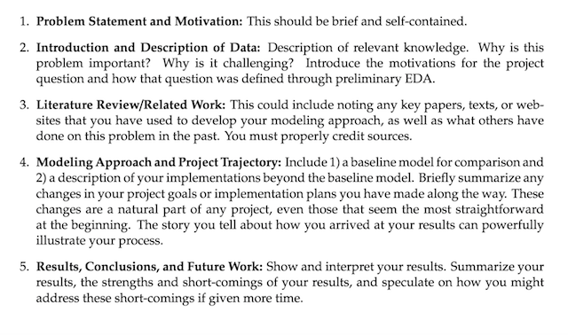

> **Created by Team 14:** *David Loving* \| *Ilan Dor* \| *Volodymyr Popil*

### Problem Statement and Motivation
> This should be brief and self-contatined.

Our goal was to figure out which features, drawn from the data available to us, were most predictive of murder rates. The motivation behind our goal rests in the simple fact that murder is and has always been a most tragic and detrimental part of society and people's lives. Therefore, if it is possible to find generic predictors (e.g., income, education level) of murder rates, doing so could help society learn where to focus efforts to reduce murders (e.g., establish a universal basic income program, provide free education).

### Introduction and Description of Data
>Description of relevant knowledge. Why this problem is important? Why is it challenging? Introduce the motivations for the project question and how that question was defined through preliminary EDA

Murder is a very tragic aspect of society but it is also a relatively (although not absolutely) rare occurrence. That is, while many people get murdered each year, most people die from causes other than murder. Solving this problem is important because murder is one of the worst crimes that plague humanity. Solving this problem is challenging due to the relative infrequency of murder makes it challenging to predict. Furthermore, while we will show that certain predictors tend to be more correlated with murder than others, murder is often a highly personal crime whose circumstances vary widely by instance.

To do this analysis, we needed two main datasets: one consisting of violent crimes (including murder rate) in each MSA (metropolitan statistical area) and another consisting of Census data about the same MSAs. The murder rates, by MSA and year, were scraped from the `ucr.fbi.gov` website (accounting for differences by year in website URL format and HTML table tags), Census data was downloaded from the `factfinder.census.gov` website and CSV files were imported into a Python script. There were numerous inconsistencies in data between years. For example, the number of features varies from year to year, as does the metadata, so we decided to fetch only 2010 (chosen arbitrarily) to perform our preliminary EDA. The subset of features was selected (excluding only some extremely redundant features) and renamed for better readability. 

After looking at a histogram which showed us a roughly normal-looking distribution of murder rates across the various MSAs with a mean of around 5 per 100,000 inhabitants, we moved our focus towards scatter plots of 190 features all taken against murder rate. From a careful visual analysis of these as well some common sense thought about forming a reasonable and varied set of predictors, we narrowed that large collection of features down to about 25. Repeating a similar analysis and scrutiny, we arrived at a selection of eight features to be used in our modeling.

For these eight features, we merged (on MSA name) the two datasets described above to create a dataset on the matching rows, only. The FBI and Census have different sets of MSAs, so we used the smaller set (Census) and most matched perfectly to the FBI data, while leaving some of the FBI data points unused. This approach seems appropriate as it is not possible to match certain FBI listed MSA's to Census data if those are not available.

We noticed that 

As the result of EDA, we have selected eight features were chosen for further modeling, data for those features was pulled for each year and combined into one dataset. Two datasets (murder rates and Census data) were merged on the MSA name, and only matching rows were considered for analysis. The FBI and Census have different sets of MSAs, so we went have used the smaller set (Census) and most matched perfectly to the FBI data, while leaving some of the FBI data points not used, as those are not be included in the MSA list on the Census side. This approach seems appropriate as it is not possible to match certain FBI listed MSA's to Census data if those are not available.

> Note: assumption is that involuntary manslaughter is equvalent to murder and so considered as one combined datapoint

### Literature Review / Related Work
>This could include noting any key papers, texts, or websites that you have used to develop your modeling approach, as well as what others have done on this problem in the past. You must properly credit sources.
>
We took our moving average approach from the Wikipedia page for that topic: 

https://en.wikipedia.org/wiki/Moving_average

It mentioned that "in science and engineering the mean is normally taken from an equal number of data on either side of a central value. This ensures that variations in the mean are aligned with the variations in the data rather than being shifted in time." Therefore, this is the approach that we used in our temporal modeling.

### Modeling Approach and Project Trajectory
>Include 1) a baseline model for comparison and 2) a description of your implementations beyond the baseline model. Briefly summarize any changes in your project goals or implementation plans you have made along the way. These changes are a natural part of any project, even those that seem the most straightforward at the beginning. The story you tell about how you arrived at your results can powerfully illustrate your process

*Todo*

### Results, Conclusions, and Future Work
>Show and interpret your results. Summarize your results, the strengths and short-coming of your results, and speculated on how you might dress these short-comings if given more time

*Todo*

   
